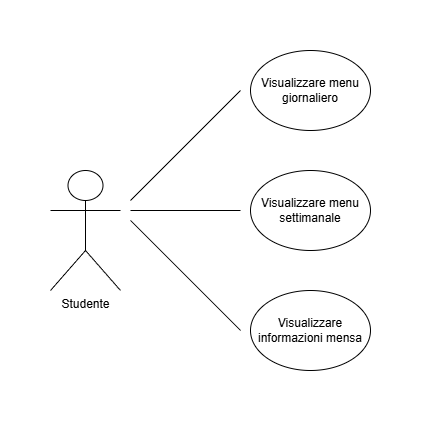
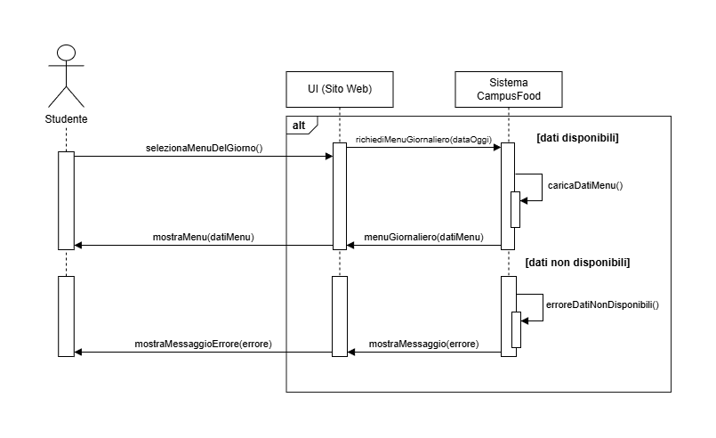
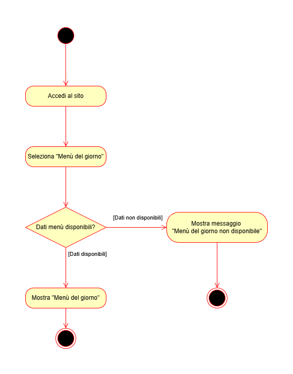

# Documento di Analisi dei Requisiti (RAD)

| Campo | Valore |
| --- | --- |
| Progetto | CampusFood-Unisa |
| Versione | 0.2 – Release 1 |
| Data | 21/10/2025 |
| Autori | Team NC03 |

---

## Nota di versione

La versione 0.2 estende la RAD v0.1 completando la descrizione dei casi d’uso UC2 e UC3, introducendo scenari aggiuntivi (6–12 totali) e includendo un diagramma di sequenza e un activity diagram.

Gli scenari alternativi descritti nel documento rappresentano possibili estensioni funzionali o varianti di interazione. La loro effettiva disponibilità nell’interfaccia utente della Release 1 dipende dalle scelte implementative, ma la loro definizione è utile ai fini dell’analisi e della progettazione futura del sistema.

---

## 1. Introduzione

### 1.1 Scopo del sistema

CampusFood-Unisa ha lo scopo di fornire agli studenti dell’Università degli Studi di Salerno un accesso semplice e centralizzato alle informazioni sulla mensa del campus di Fisciano, attraverso un sito web responsive per la consultazione di menù e orari.

### 1.2 Campo di applicazione

Il sistema riguarda esclusivamente la mensa del campus di Fisciano.

In questa versione (Release 1) sono previste le seguenti funzionalità:

- visualizzazione del menù giornaliero
- visualizzazione del menù settimanale
- consultazione degli orari di apertura e chiusura
- visualizzazione indicativa della disponibilità posti (dato simulato, a scopo informativo)

Funzionalità previste a livello progettuale ma non trattate nella Release 1:

- prenotazione dei pasti o dei posti
- autenticazione e gestione profili
- gestione dei menù lato personale mensa
- notifiche automatiche

### 1.3 Obiettivi

Il sistema sarà considerato soddisfacente se lo studente può:

- conoscere facilmente i piatti disponibili nella giornata o settimana corrente
- recuperare rapidamente gli orari della mensa
- accedere ai contenuti da desktop o mobile in modo intuitivo

### 1.4 Glossario

| Termine | Descrizione |
| --- | --- |
| Menù giornaliero | Lista dei piatti disponibili nella giornata |
| Menù settimanale | Pianificazione dei menù dei giorni della settimana |
| Mock Data | Dati simulati usati per una prima versione dimostrativa |

---

## 2. Sistema attuale

Attualmente gli studenti reperiscono informazioni sulla mensa tramite:

- comunicazioni fisiche all’interno della mensa
- fonti non ufficiali online
- passaparola

Questo comporta:

- difficoltà nella pianificazione dei pasti
- picchi di presenza non gestiti
- scarsa comunicazione centralizzata delle informazioni

---

## 3. Sistema proposto

### 3.1 Panoramica

CampusFood-Unisa offrirà una piattaforma informativa facilmente accessibile che consente di visualizzare menù e orari aggiornati o simulati.

Nella Release 1 il sistema non prevede funzionalità di gestione dei dati, autenticazione utenti o interazione avanzata.

---

### 3.2 Attori

| Attore | Descrizione |
| --- | --- |
| Studente | Utente che consulta le informazioni della mensa |

(Gli attori Gestore Mensa e Amministratore di Sistema verranno introdotti nelle release successive.)

---

### 3.3 Requisiti funzionali (Release 1)

| ID | Descrizione | Priorità |
| --- | --- | --- |
| RF1 | Visualizzare il menù giornaliero | Alta |
| RF2 | Visualizzare il menù settimanale | Alta |
| RF3 | Consultare gli orari di apertura e chiusura | Alta |
| RF4 | Fruire dei contenuti da desktop e dispositivi mobili | Alta |
| RF5 | Visualizzare un’indicazione indicativa della disponibilità posti (dato simulato) | Media |

#### Funzionalità future (fuori ambito Release 1)

- RF6: Prenotazione pasti e posti
- RF7: Gestione utenti, ruoli e autenticazione
- RF8: Statistiche e reportistica per il personale mensa
- RF9: Notifiche automatiche

---

### 3.4 Requisiti non funzionali

| ID | Categoria | Descrizione |
| --- | --- | --- |
| RNF1 | Usabilità | Interfaccia semplice e comprensibile da uno studente medio |
| RNF2 | Portabilità | Accessibile dai principali browser desktop e mobile |
| RNF3 | Performance | Il menù giornaliero deve essere visualizzato entro 3 secondi |
| RNF4 | Affidabilità | In assenza di dati, deve essere mostrato un messaggio informativo |
| RNF5 | Estendibilità | Predisposizione a integrazioni future senza riscritture radicali |
| RNF6 | Accessibilità | Layout leggibile, con contrasto adeguato e struttura semantica |

---

### 3.5 Modelli di Sistema

#### Use Case Diagram – Release 1

#### 3.5.1 Casi d’uso principali (Release 1)

- UC1 – Visualizzare menù giornaliero
- UC2 – Visualizzare menù settimanale
- UC3 – Visualizzare informazioni mensa

---

## 3.6 Scenari e descrizione dei casi d’uso

> Nota: Gli scenari seguenti portano il totale a **8 scenari complessivi** (compresi principali e alternativi), rispettando il vincolo 6–12.

### UC1 – Visualizzare menù giornaliero

| Campo | Descrizione |
| --- | --- |
| Attore principale | Studente |
| Pre-condizioni | Connessione al sito attiva |
| Post-condizioni | Menù giornaliero visualizzato oppure messaggio informativo |

#### Scenario 1 (principale) – Consultazione menù del giorno

1. Lo studente accede al sito.
2. Seleziona la voce “Menù del giorno”.
3. Il sistema recupera i dati del menù (mock data).
4. Il sistema mostra il menù del giorno.

#### Scenario 2 (alternativo) – Consultazione menù di un altro giorno (opzionale)

1. Lo studente accede al menù del giorno.
2. Seleziona una data/giorno differente (se disponibile nell’interfaccia).
3. Il sistema recupera i dati del menù per la data selezionata.
4. Il sistema mostra il menù relativo al giorno selezionato.

#### Scenario 3 (eccezione) – Dati non disponibili

- Se i dati del menù non sono disponibili, il sistema mostra un messaggio informativo (“Menù non disponibile”).

---

### UC2 – Visualizzare menù settimanale

| Campo | Descrizione |
| --- | --- |
| Attore principale | Studente |
| Pre-condizioni | Connessione al sito attiva |
| Post-condizioni | Menù settimanale visualizzato oppure messaggio informativo |

#### Scenario 4 (principale) – Visualizzazione menù settimanale

1. Lo studente accede al sito.
2. Seleziona la voce “Menù settimanale”.
3. Il sistema recupera i dati della settimana corrente (mock data).
4. Il sistema mostra l’elenco dei menù per i giorni della settimana.

#### Scenario 5 (alternativo) – Selezione di un giorno dalla settimana (opzionale)

1. Lo studente visualizza il menù settimanale.
2. Seleziona un giorno specifico (es. “Mercoledì”).
3. Il sistema evidenzia/mostra i dettagli del menù di quel giorno.

#### Scenario 6 (eccezione) – Menù settimanale non disponibile

- Se i dati settimanali non sono disponibili, il sistema mostra un messaggio informativo (“Menù settimanale non disponibile”).

---

### UC3 – Visualizzare informazioni mensa

| Campo | Descrizione |
| --- | --- |
| Attore principale | Studente |
| Pre-condizioni | Connessione al sito attiva |
| Post-condizioni | Informazioni mensa visualizzate oppure messaggio informativo |

#### Scenario 7 (principale) – Consultazione orari e informazioni

1. Lo studente accede al sito.
2. Seleziona la voce “Informazioni mensa”.
3. Il sistema mostra orari di apertura/chiusura e note informative.

#### Scenario 8 (alternativo) – Consultazione disponibilità posti indicativa

1. Lo studente è nella pagina “Informazioni mensa”.
2. Il sistema mostra un’indicazione indicativa della disponibilità dei posti, basata su dati simulati e a solo scopo informativo.
3. Lo studente consulta l’indicazione per orientarsi sulla scelta dell’orario.

(In caso di dati mancanti, il sistema mostra un messaggio informativo coerente con RNF4.)

---

## 3.7 Modello dinamico (richieste del corso)

### 3.7.1 Sequence Diagram (1 totale)

Viene prodotto un solo diagramma di sequenza, relativo al caso d’uso principale UC1.

### Sequence Diagram – UC1 (Visualizzazione menù giornaliero)

### 3.7.2 Activity Diagram / Statechart (1 totale)

Viene prodotto un solo activity diagram relativo al flusso di consultazione del menù giornaliero.

### Activity Diagram – UC1 (Consultazione menù giornaliero)

---

## 4. Struttura delle pagine (Release 1)

| Pagina | Contenuto | Note |
| --- | --- | --- |
| Home | Introduzione e navigazione principale | Entry point |
| Menù del giorno | Visualizzazione piatti del giorno | RF1 |
| Menù settimanale | Vista riepilogativa settimanale | RF2 |
| Informazioni mensa | Orari e disponibilità posti indicativa | RF3, RF5 |
| Contatti | Team, corso e disclaimer prototipo | Supporto |

---

## 5. Criteri di accettazione Release 1

La Release 1 sarà considerata completata se:

- tutti i requisiti funzionali RF1–RF5 risultano soddisfatti
- la navigazione tra le pagine è chiara e coerente
- i contenuti sono consultabili correttamente da dispositivi mobili

---
